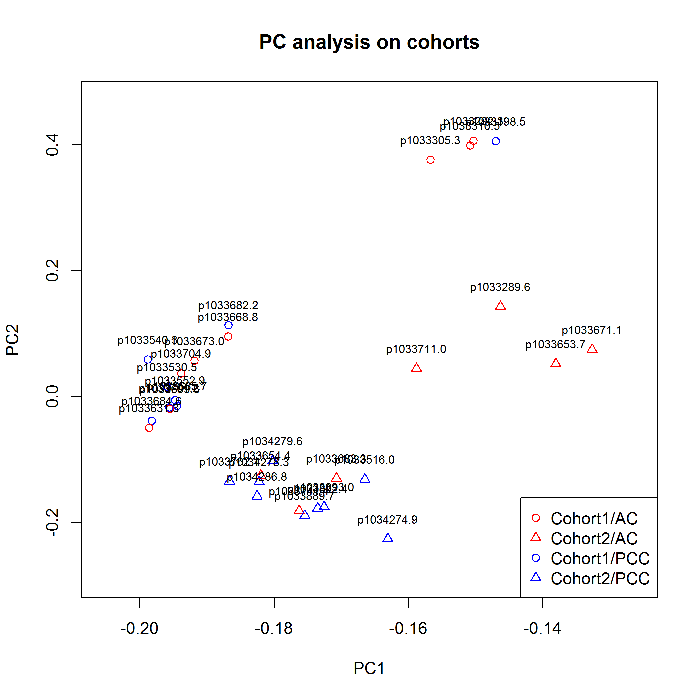

Sjogren syndrome microarray data analysis
========================================================
Topics to be covered:
* Data preparation
* Using ComBat to account for batch effect
* Machine learning on clinical meta-data

Data preparation
--------------------


`annot.txt` is taken from `Single-experiment raw data3//annot3.txt`

`data.txt` are combined from `01.Data.Analysis.xlsx` and `11.Data.xlsx`.

`meta1.txt` is taken from `11 Annotations final cohorts sheet 2 20DEC13 DF.xlsx` and contains cohort information. The data has been transposed  to have patients names as columns for compatibility with `data.txt`

`meta2.txt` is taken from `20140214FarrisMicroarraymgdb(1).xlsx` (03-13-2014). The data has been transposed. Patient `p1033680-6` has been renamed to `p1033680-6 (-5)` to be compatible with `data.txt` headers.


Principal component analysis of the original data, two groups and two cohorts.


```r
outliersRemove <- FALSE
meta <- loadMeta(outliersRemove)
exprs.n <- loadExprs(outliersRemove)
prinComponents(exprs.n)
```


Clearly, cohorts are heavily different. The two patients, p1033216.2 and p1033680.6...5., appear as outliers - remove them and loot at the principal components again.


```r
outliersRemove <- TRUE
meta <- loadMeta(outliersRemove)
exprs <- loadExprs(outliersRemove)
prinComponents(exprs)
```




