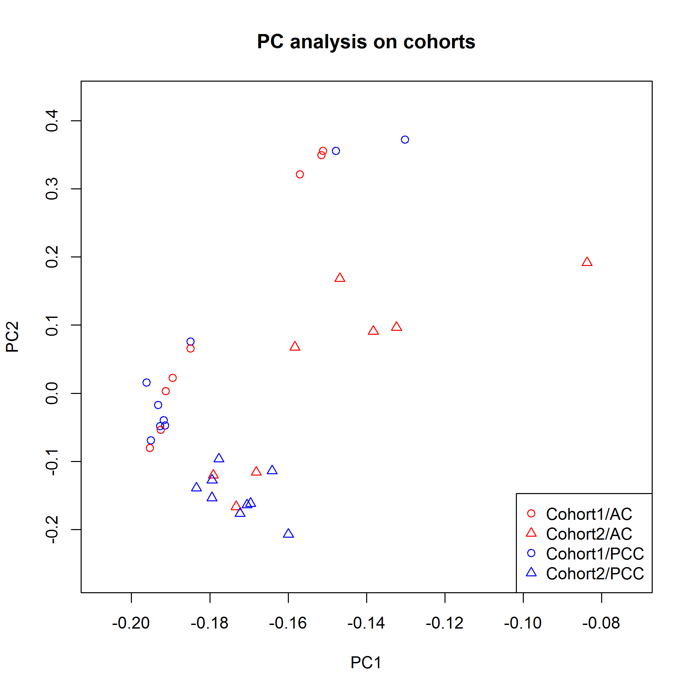
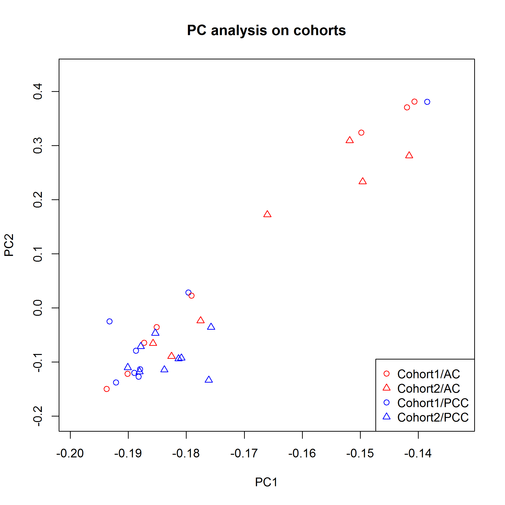
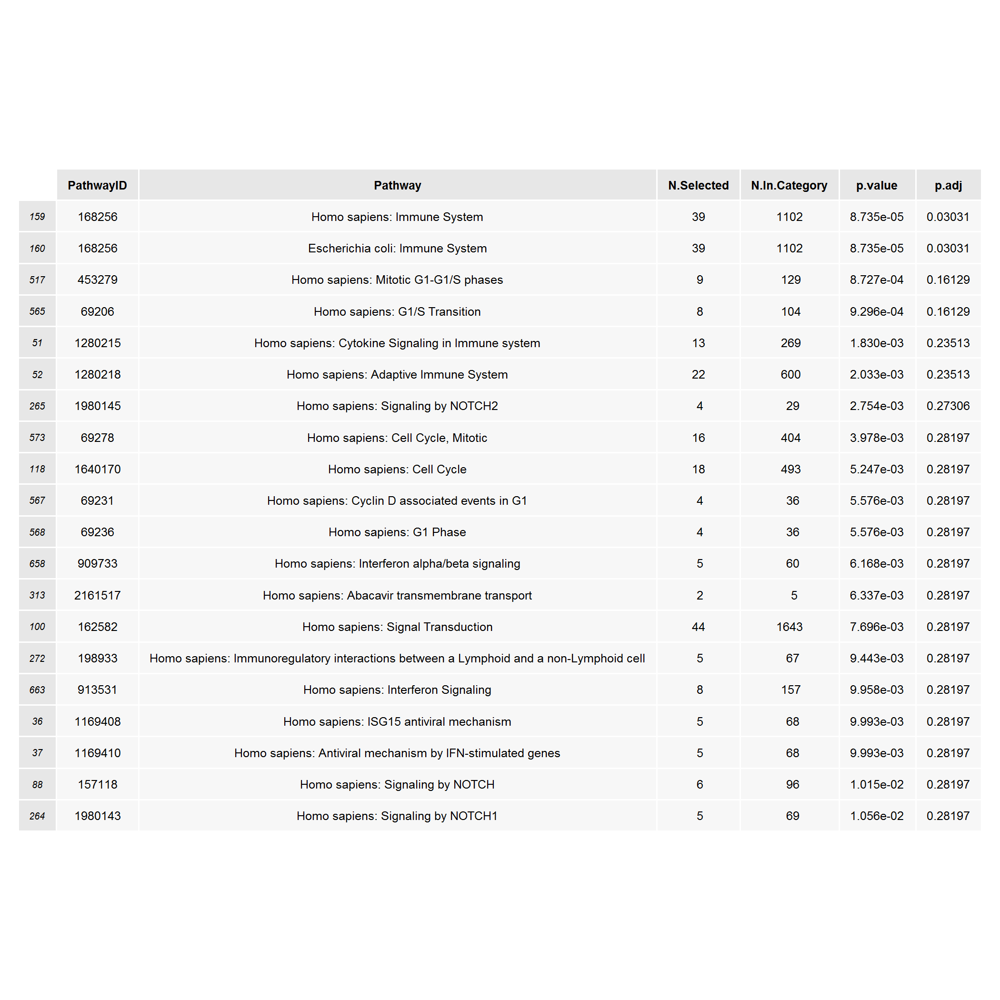
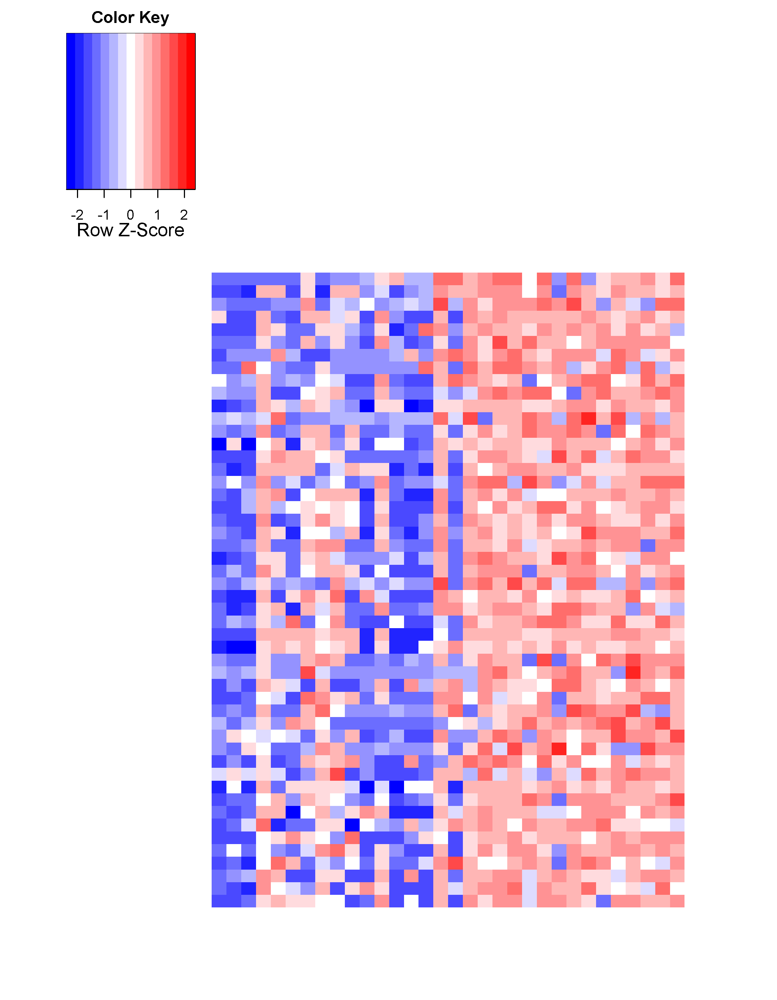
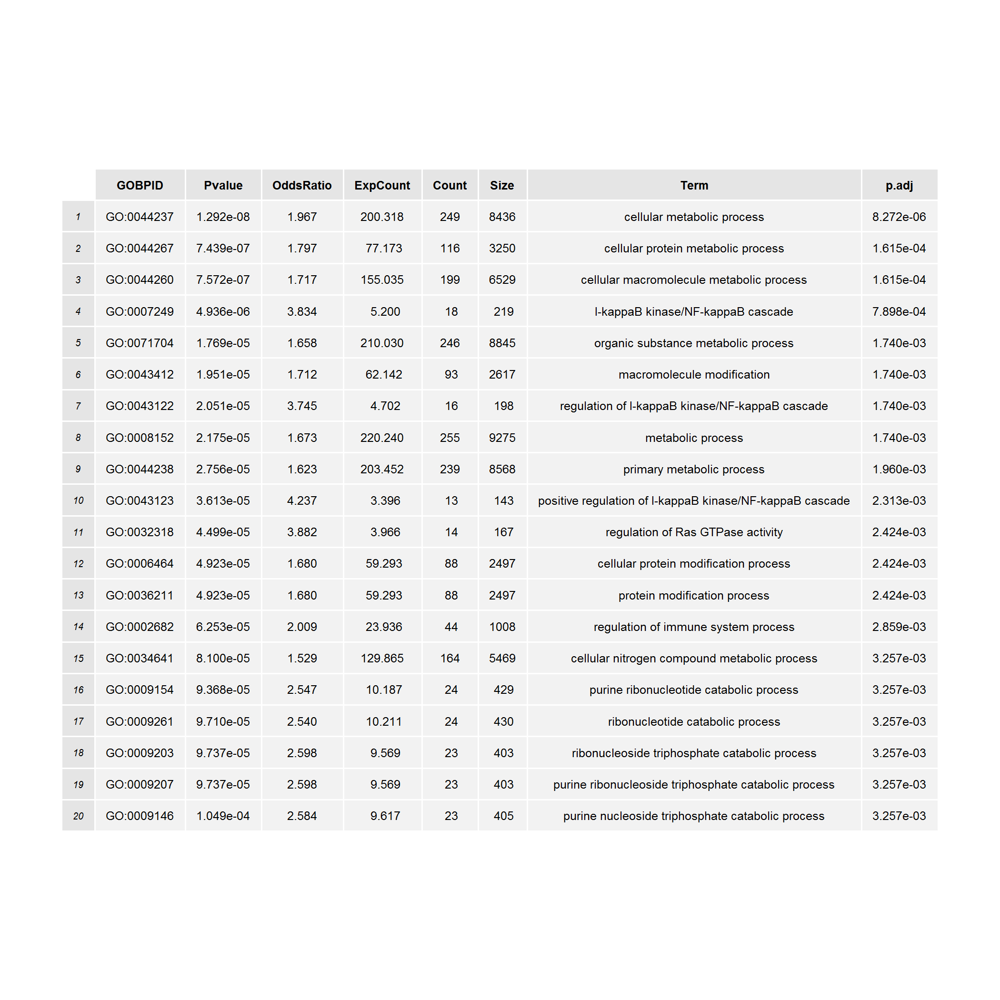
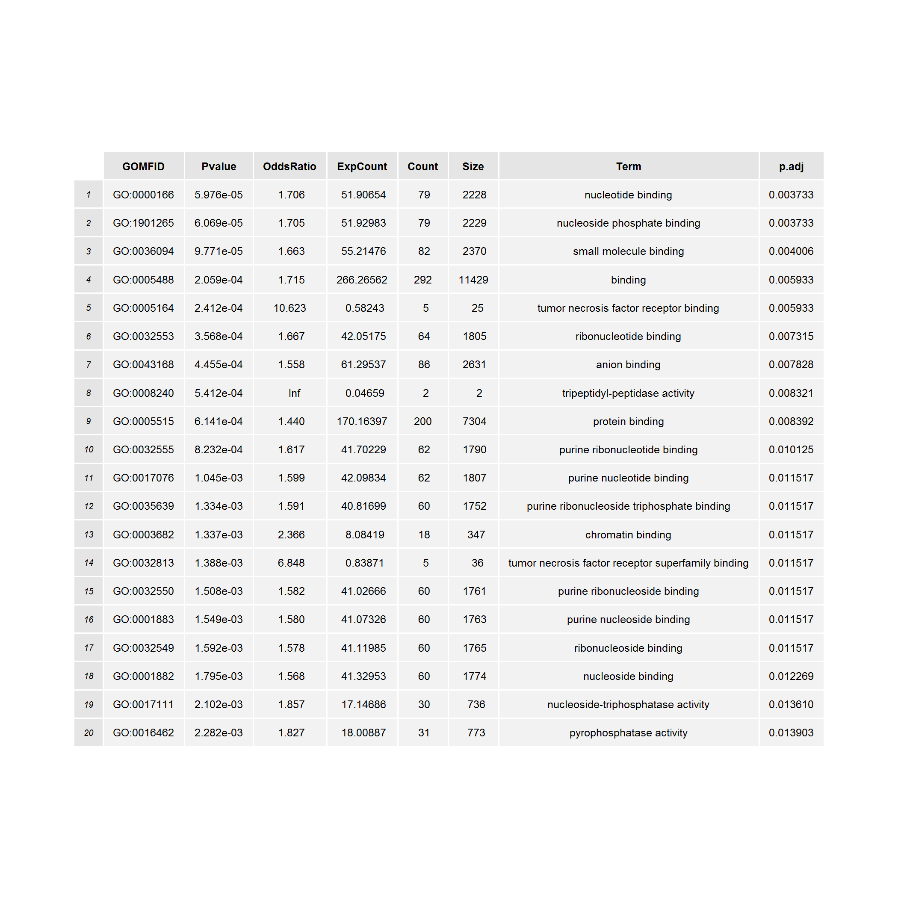
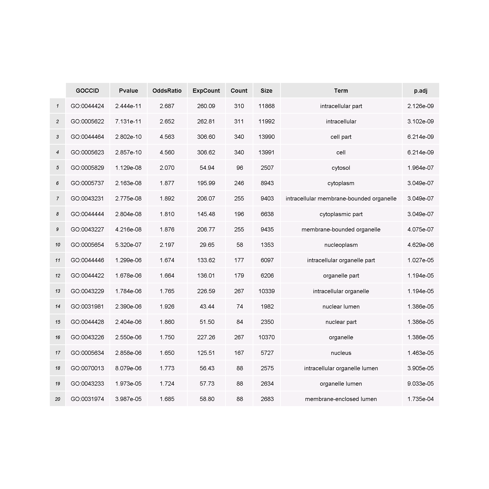

Sjogren syndrome microarray data analysis
========================================================
Topics to be covered:
* Data preparation
* Using ComBat to account for batch effect
* TODO


```
## ==========================================================================
## *
## *  Package WGCNA 1.34 loaded.
## *
## *    Important note: It appears that your system supports multi-threading,
## *    but it is not enabled within WGCNA in R. 
## *    To allow multi-threading within WGCNA with all available cores, use 
## *
## *          allowWGCNAThreads()
## *
## *    within R. Use disableWGCNAThreads() to disable threading if necessary.
## *    Alternatively, set the following environment variable on your system:
## *
## *          ALLOW_WGCNA_THREADS=<number_of_processors>
## *
## *    for example 
## *
## *          ALLOW_WGCNA_THREADS=12
## *
## *    To set the environment variable in linux bash shell, type 
## *
## *           export ALLOW_WGCNA_THREADS=12
## *
## *     before running R. Other operating systems or shells will
## *     have a similar command to achieve the same aim.
## *
## ==========================================================================
```


```r
# A wrapper function to visualize top 20 genes best correlated with a clinical parameter, and perform pathway/GO
# enrichment analysis on top 100 best correlated genes
clinCorrel <- function(m, fileName = NULL) {
    corrgenes <- apply(combat_edata, 1, function(x) cor(x, m))
    corrgenes <- sort(corrgenes, decreasing = T)
    if (!is.null(fileName)) {
        write.table(result, paste("results//", fileName, sep = ""), sep = "\t", row.names = F)
    }
    grid.table(merge(corrgenes[1:20], annot.f, by = "row.names"), gp = gpar(fontsize = 6), core.just = "left")
    return(corrgenes)
}

clinCorrelPathways <- function(genes, fileName = NULL) {
    res.pathway <- reactomeEnrichment(as.matrix(genes))
    message(paste("Number of significant pathways:", res.pathway[[2]]))
    if (res.pathway[[2]] > 0) {
        if (!is.null(fileName)) {
            write.table(result, paste("results//", fileName, sep = ""), sep = "\t", row.names = F)
        }
        if (res.pathway[[2]] > 20) {
            t <- 20
        } else {
            t <- res.pathway[[2]]
        }
        grid.table(res.pathway[[1]][1:t, ], gp = gpar(fontsize = 6))
    }
}

clinCorrelGOs <- function(genes, fileName = NULL) {
    res.GO <- GOEnrichment(as.matrix(genes))
    message(paste("Number of significant ontologies:", res.GO[[2]]))
    if (res.GO[[2]] > 0) {
        if (!is.null(fileName)) {
            write.table(result, paste("results//", fileName, sep = ""), sep = "\t", row.names = F)
        }
        if (res.GO[[2]] > 20) {
            t <- 20
        } else {
            t <- res.GO[[2]]
        }
        grid.table(res.GO[[1]][1:t, ], gp = gpar(fontsize = 6))
    }
}
```


Data preparation
--------------------

`annot.txt` is taken from `Single-experiment raw data3//annot3.txt`

`data.txt` are combined from `01.Data.Analysis.xlsx` and `11.Data.xlsx`.

`meta1.txt` is taken from `11 Annotations final cohorts sheet 2 20DEC13 DF.xlsx` and contains cohort information. The data has been transposed  to have patients names as columns for compatibility with `data.txt`

`meta2.txt` is taken from `20140214FarrisMicroarraymgdb(1).xlsx` (accessed on 03-13-2014). The data has been transposed. ID `p1033680-6` has been renamed to `p1033680-6 (-5)` to be compatible with the `data.txt` header.


To identify the largest source of variability within the data, we perform principal component analysis and color the samples by Cohort/Treatment status.


```r
outliersRemove <- FALSE
meta <- loadMeta(outliersRemove)
exprs.n <- loadExprs(outliersRemove)
# arrayQualityMetrics(new('ExpressionSet', exprs=exprs.n), outdir='arrayQC_WithOutliers')
```


```r
prinComponents(log2(exprs.n))
```




Clearly, the cohorts are very different. The two patients, p1033216.2 and p1033680.6...5., appear as outliers. They are also picked up by the _arrayQualityMetrics_ set of tests. 

We remove them and look at the principal components again.


```r
outliersRemove <- TRUE
meta <- loadMeta(outliersRemove)
exprs.n <- loadExprs(outliersRemove)
# arrayQualityMetrics(new('ExpressionSet', exprs=exprs.n), outdir='arrayQC_WithoutOutliers')
```


```r
prinComponents(log2(exprs.n))
```


The data looks more homogeneous now, with the cohort effect still dominating.

To further investigate how the outliers affect differential gene expression, we will perform differential expression _limma_ analysis on the expression data with and without outlier, as well as check for the enriched pathways. 


```r
outliersRemove <- FALSE
meta <- loadMeta(outliersRemove)
exprs.n <- loadExprs(outliersRemove)
# arrayQualityMetrics(new('ExpressionSet', exprs=exprs.n), outdir='arrayQC_WithOutliers')
res <- limmaOnData(exprs.n, "MicroarrayClass")
nrow(res)
```

```
## [1] 41
```

```r
res.pathway <- reactomeEnrichment(res)
res.pathway[[2]]
```

```
## [1] 0
```


Not many probes are differentially expressed out of 62976 total. No pathway enrichment either.


```r
outliersRemove <- TRUE
meta <- loadMeta(outliersRemove)
exprs.n <- loadExprs(outliersRemove)
# arrayQualityMetrics(new('ExpressionSet', exprs=exprs.n), outdir='arrayQC_WithoutOutliers')
res <- limmaOnData(exprs.n, "MicroarrayClass")
nrow(res)
```

```
## [1] 169
```

```r
res.pathway <- reactomeEnrichment(res)
res.pathway[[2]]
```

```
## [1] 0
```


Removing the outliers definitely helps to improve sensitivity in detecting differentially expressed genes. But not enough to see any pathway enrichment.

Using ComBat to account for batch effect
-----------------------------------------

To investigate batch effect in raw data, we will test the differences between the cohorts of patients, without considering their treatment status. The outliers were removed.


```r
res <- limmaOnData(exprs.n, "Cohort")
nrow(res)
```

```
## [1] 19562
```

```r
res.pathway <- reactomeEnrichment(res)
res.pathway[[2]]
```

```
## [1] 0
```


Almost 1/3 of the probes are differentially expressed between cohorts. They show no pathway enrichment.

We use ComBat to manually adjust for the cohort effect and keep the treatment effect. If we look at the PCA plot after the adjustment, the data look more homogeneous, and the cohorts are now mixed together.


```r
combat_edata <- ComBat(dat = exprs.n, batch = meta$Cohort, mod = model.matrix(~as.factor(MicroarrayClass), data = meta), 
    numCovs = NULL, par.prior = TRUE, prior.plots = F)
```

```
## Found 2 batches
## Found 1  categorical covariate(s)
## Standardizing Data across genes
## Fitting L/S model and finding priors
## Finding parametric adjustments
## Adjusting the Data
```

```r
prinComponents(combat_edata)
```




And no differentially expressed genes can be detected after removing the batch effect.


```r
res <- limmaOnData(combat_edata, "Cohort")
nrow(res)
```

```
## [1] 0
```


Enrichment analysis
===================
Reactome canonical pathway enrichment analysis
----------------------------------------------

So far we used the complete dataset with 62976 probes. However, probes constantly expressed across the conditions are less interesting to us. To increase power of detecting differentially expressed genes, we filter such constantly expressed genes.


```r
# Filtering low variability probes
combat_edata <- exprs(varFilter(new("ExpressionSet", exprs = combat_edata)))
nrow(combat_edata)
```

```
## [1] 31488
```


Almost half of the probes were removed. The number of DEGs expectedly increased (with less probes we have more power to detect DEGs) from 754 to 784.

After removing batch effect, we not only get more differentially expressed genes, but also enriched pathways. The total number, and the top 30 most tignificant pathways are shown.


```r
res <- limmaOnData(combat_edata, "MicroarrayClass", "limma_MicroarrayClass_WithoutOutliers_WithoutBatch.txt")
nrow(res)
```

```
## [1] 784
```

```r
res.pathway <- reactomeEnrichment(res, "Cohort_Reactome.txt")
res.pathway[[2]]
```

```
## [1] 6
```

```r
grid.table(res.pathway[[1]][1:30, ], gp = gpar(fontsize = 7))
```




Let's have a look at top 50 differentially expressed genes. Multiple probes for the same gene are collapsed to one by maximum expression level.


```r
degs <- collapseRows(combat_edata[rownames(res), ], annot.f[rownames(res), "GeneName"], rownames(res))
# Sort the collapsed data by the largest absolute fold change
maxRatio <- rowMeans(degs$datETcollapsed[, meta$MicroarrayClass == "PSS"]) - rowMeans(degs$datETcollapsed[, meta$MicroarrayClass == 
    "AC"])
degs.sorted <- degs$datETcollapsed[order(abs(maxRatio), decreasing = T), order(meta$MicroarrayClass)]
# Or just use the most significant data, columns reordered degs.sorted <- degs$datETcollapsed[,
# order(meta$MicroarrayClass)]
color <- colorRampPalette(c("blue", "white", "red"))
if (HIDE) labCol <- "" else labCol <- colnames(degs.sorted)
if (HIDE) labRow <- "" else labRow <- rownames(degs.sorted)
heatmap.2(degs.sorted[1:50, ], Colv = F, Rowv = F, scale = "row", trace = "none", col = color, key = F, density.info = "none", 
    cexCol = 1, cexRow = 0.8, labCol = labCol, labRow = labRow[1:50])  #, cellnote=formatC(1/10^abs(mtx), format='e', digits=2), notecol='darkgreen')
```




We aggregate probe names summarizing expression of the same gene by maximum fold change (because Ingenuity does it wrong).


```r
# Merge limma results and annotations
tmp <- merge(res, annot.f, by = "row.names")
# Get unique 'gene name - max logFC' pairs'
degs <- aggregate(tmp[, "logFC"], by = list(tmp$GeneName), max)
degs.tmp <- merge(degs, tmp, by.x = "x", by.y = "logFC")
write.table(degs.tmp, "results/limma_MicroarrayClass_WithoutOutliers_WithoutBatch_IPA.txt", sep = "\t", quote = F, col.names = NA)
```


Gene ontology enrichment analysis
-------------------------------------

First, look at the total number and the top 20 significant ontologies in the "Biological Process" space (Normally, most informative functions).


```r
res.go <- GOEnrichment(res, "BP", "Cohort_GO_BP.txt")
res.go[[2]]
```

```
## [1] 640
```

```r
grid.table(res.go[[1]][1:20, ], gp = gpar(fontsize = 6))
```




Second, look at the total number and the top 20 significant ontologies in the "Molecular Function" space (Second most informative).


```r
res.go <- GOEnrichment(res, "MF")
res.go[[2]]
```

```
## [1] 123
```

```r
grid.table(res.go[[1]][1:20, ], gp = gpar(fontsize = 6))
```




Finally, look at the total number and the top 20 significant ontologies in the "Cellular Component" space (Least informative).


```r
res.go <- GOEnrichment(res, "CC")
res.go[[2]]
```

```
## [1] 87
```

```r
grid.table(res.go[[1]][1:20, ], gp = gpar(fontsize = 6))
```




Genes best correlating with clinical parameters
=====================================
Interesting clinical parameters are: WUSFvol, SSFvolL, SSFvolR, LGleft, LGright, FS, LaBioRadvalue, RoBioRadvalue, RFvalue. For each clinical parameter, we answer 3 questions:

1) What are the top 20 genes best correlated with a clinical parameter?

2) Are those genes enriched in canonical pathways? Which? In how many?

3) Are those genes enriched in "biological process" gene ontologies? Which? In how many?

WUSFvol
-----------

```r
correlGenes <- clinCorrel(meta$WUSFvol)
```


```r
clinCorrelPathways(correlGenes)
```

```
## Number of significant pathways: 7
```


```r
clinCorrelGOs(correlGenes)
```

```
## Number of significant ontologies: 931
```


SSFvolL
-----------

```r
correlGenes <- clinCorrel(meta$SSFvolL)
```


```r
clinCorrelPathways(correlGenes)
```

```
## Number of significant pathways: 7
```


```r
clinCorrelGOs(correlGenes)
```

```
## Number of significant ontologies: 931
```


SSFvolR
-----------

```r
correlGenes <- clinCorrel(meta$SSFvolR)
```


```r
clinCorrelPathways(correlGenes)
```

```
## Number of significant pathways: 7
```


```r
clinCorrelGOs(correlGenes)
```

```
## Number of significant ontologies: 931
```


LGleft
-----------

```r
correlGenes <- clinCorrel(meta$LGleft)
```


```r
clinCorrelPathways(correlGenes)
```

```
## Number of significant pathways: 7
```


```r
clinCorrelGOs(correlGenes)
```

```
## Number of significant ontologies: 931
```


LGright
-----------

```r
correlGenes <- clinCorrel(meta$LGright)
```


```r
clinCorrelPathways(correlGenes)
```

```
## Number of significant pathways: 7
```


```r
clinCorrelGOs(correlGenes)
```

```
## Number of significant ontologies: 931
```


FS
-----------

```r
correlGenes <- clinCorrel(meta$FS)
```


```r
clinCorrelPathways(correlGenes)
```

```
## Number of significant pathways: 7
```


```r
clinCorrelGOs(correlGenes)
```

```
## Number of significant ontologies: 931
```


LaBioRadvalue
-----------

```r
correlGenes <- clinCorrel(meta$LaBioRadvalue)
```


```r
clinCorrelPathways(correlGenes)
```

```
## Number of significant pathways: 7
```


```r
clinCorrelGOs(correlGenes)
```

```
## Number of significant ontologies: 931
```


RoBioRadvalue
-----------

```r
correlGenes <- clinCorrel(meta$RoBioRadvalue)
```


```r
clinCorrelPathways(correlGenes)
```

```
## Number of significant pathways: 7
```


```r
clinCorrelGOs(correlGenes)
```

```
## Number of significant ontologies: 931
```


RFvalue
-----------

```r
correlGenes <- clinCorrel(meta$RFvalue)
```


```r
clinCorrelPathways(correlGenes)
```

```
## Number of significant pathways: 7
```


```r
clinCorrelGOs(correlGenes)
```

```
## Number of significant ontologies: 931
```


TODO:

* Machine learning on clinical meta-data
